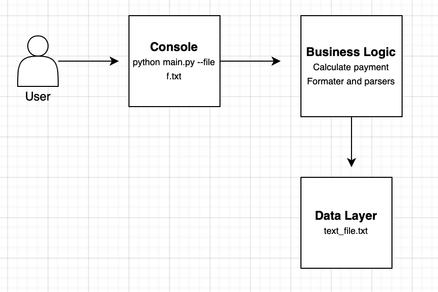

# IOET Coding problem

## Excercise:

The company ACME offers their employees the flexibility to work the hours they want. They will pay for the hours worked based on the day of the week and time of day, according to the following table:


| Monday-Friday | Saturday and Sunday |
| ------ | ------ |
| 00:01 - 09:00  $25| 00:01 - 09:00  $30|
| 09:01 - 18:00  $15| 09:01 - 18:00  $20|
| 18:01 - 00:00  $20| 18:01 - 00:00  $25|

The goal of this exercise is to calculate the total that the company has to pay an employee, based on the hours they worked and the times during which they worked. The following abbreviations will be used for entering data:

| MO: | Monday |
| ------ | ------ |
| TU: | Tuesday|
| WE: | Wednesday|
| TH: | Thursday|
| FR: | Thursday|
| SA: | Saturday|
| SU: | Sunday|

Input: the name of an employee and the schedule they worked, indicating the time and hours. This should be a .txt file with at least five sets of data. You can include the data from our two examples below.

Output: indicate how much the employee has to be paid

For example:
| Case| Input|Output|
| ------ | ------ | ------ |
| 1 | RENE=MO10:00-12:00,TU10:00-12:00,TH01:00-03:00,SA14:00-18:00,SU20:00-21:00|The amount to pay RENE is: 215 USD|
| 2 | ASTRID=MO10:00-12:00,TH12:00-14:00,SU20:00-21:00|The amount to pay ASTRID is: 85 USD|

## Solution Overview
To perform this exercise I used the latest version of python (3.9).
There are four components in this project:
- **main file**: uses [argparse](https://docs.python.org/3/library/argparse.html#module-argparse) (command line parsing module) to read the input file from the command line and use it as parameter for the function that compute the amount to pay.
- **payment_calc file**: this file contains four functions, three of them are used to calculate the amount to pay per hour, day and week; the fourth function is used to calculate the amount to pay per worked schedule of each line of the file.
- **utils folder**: this folder contains three files:
  - **constants file**: constants used throughout the project.
  - **file_parser file**: the purpose of this file is to read the input file, validate the content using `regex` and return an array.
  - **time_parser file**: format hours
- **test folder**: contains unit tests for the functions 
## Architecture

## Approach Methodology
My approach to this exercise was to create a simple and clean code structured into files. Each function performs only one task with a consistent result (FP like)
<br/>
The steps to solve the exercise where:
  - Read the problem and write down a solution on paper
  - Analyze the solution
  - Find edge cases
  - Add fixes to the solution
  - Code
  - Repeat
## How to run
### First clone the project

```bash
git clone https://github.com/luisadriantt/paymentsACME
cd paymentsACME
```

### Execute Application

```bash
python main.py --file <file_name>
Using test file:
python main.py --file work_info.txt
```

### Run Tests
```bash
cd test
python <test_file>
```

